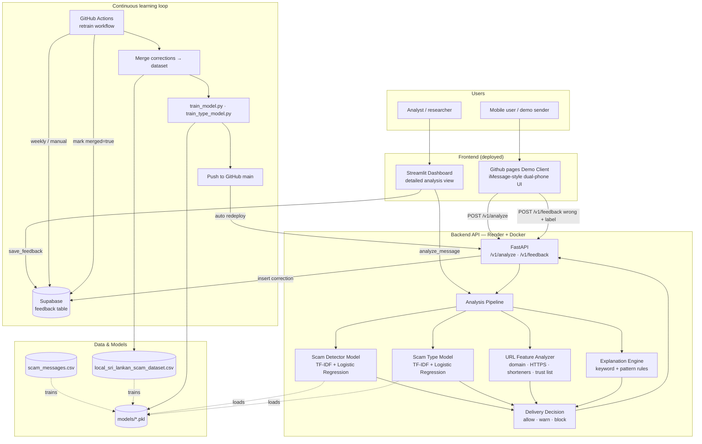
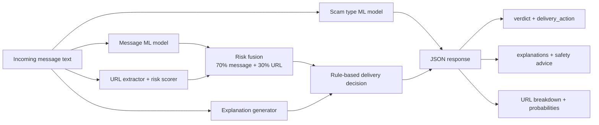
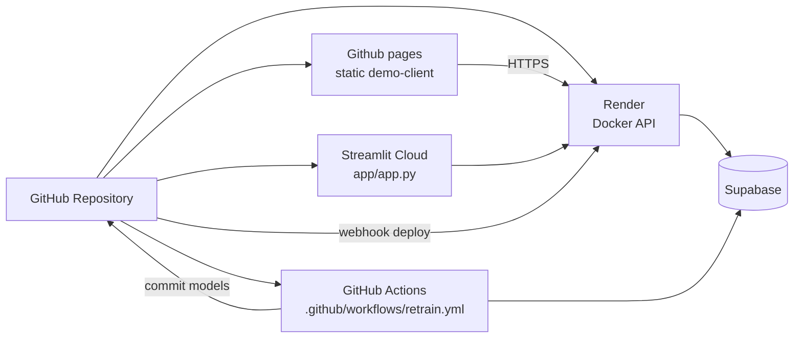

## System architecture

### High-level diagram

```mermaid
flowchart TB
    subgraph Users
        U1[Mobile user / demo sender]
        U2[Analyst / researcher]
    end

    subgraph Frontend["Frontend (deployed)"]
        NC[Github pages Demo Client<br/>iMessage-style dual-phone UI]
        ST[Streamlit Dashboard<br/>detailed analysis view]
    end

    subgraph API["Backend API — Render + Docker"]
        FA[FastAPI<br/>/v1/analyze · /v1/feedback]
        PIPE[Analysis Pipeline]
        ML1[Scam Detector Model<br/>TF-IDF + Logistic Regression]
        ML2[Scam Type Model<br/>TF-IDF + Logistic Regression]
        URL[URL Feature Analyzer<br/>domain · HTTPS · shorteners · trust list]
        EXP[Explanation Engine<br/>keyword + pattern rules]
        RULES[Delivery Decision<br/>allow · warn · block]
    end

    subgraph Data["Data & Models"]
        DS1[(scam_messages.csv)]
        DS2[(local_sri_lankan_scam_dataset.csv)]
        PKL[(models/*.pkl)]
    end

    subgraph Learning["Continuous learning loop"]
        SB[(Supabase<br/>feedback table)]
        GHA[GitHub Actions<br/>retrain workflow]
        MERGE[Merge corrections → dataset]
        TRAIN[train_model.py · train_type_model.py]
        GIT[Push to GitHub main]
    end

    U1 --> NC
    U2 --> ST
    NC -->|POST /v1/analyze| FA
    ST -->|analyze_message| PIPE
    FA --> PIPE
    PIPE --> ML1
    PIPE --> ML2
    PIPE --> URL
    PIPE --> EXP
    ML1 --> RULES
    ML2 --> RULES
    URL --> RULES
    EXP --> RULES
    RULES --> FA
    ML1 -.loads.-> PKL
    ML2 -.loads.-> PKL
    DS1 -.trains.-> PKL
    DS2 -.trains.-> PKL

    NC -->|POST /v1/feedback wrong + label| FA
    ST -->|save_feedback| SB
    FA -->|insert correction| SB
    GHA -->|weekly / manual| SB
    GHA --> MERGE
    MERGE --> DS2
    MERGE --> TRAIN
    TRAIN --> PKL
    TRAIN --> GIT
    GIT -->|auto redeploy| FA
    GHA -->|mark merged=true| SB
```

### Analysis pipeline (single message)

```mermaid
flowchart LR
    MSG[Incoming message text] --> NLP[Message ML model]
    MSG --> TYPE[Scam type ML model]
    MSG --> URLS[URL extractor + risk scorer]
    MSG --> EXPL[Explanation generator]

    NLP --> FUSE[Risk fusion<br/>70% message + 30% URL]
    URLS --> FUSE
    FUSE --> DECIDE[Rule-based delivery decision]
    EXPL --> DECIDE
    TYPE --> OUT[JSON response]
    DECIDE --> OUT

    OUT --> A1[verdict + delivery_action]
    OUT --> A2[explanations + safety advice]
    OUT --> A3[URL breakdown + probabilities]
```

### Deployment architecture

```mermaid
flowchart LR
    GH[GitHub Repository] --> NET[Github pages<br/>static demo-client]
    GH --> REN[Render<br/>Docker API]
    GH --> STR[Streamlit Cloud<br/>app/app.py]
    GH --> GHA[GitHub Actions<br/>.github/workflows/retrain.yml]

    NET -->|HTTPS| REN
    STR --> REN
    REN --> SB[(Supabase)]
    GHA --> SB
    GHA -->|commit models| GH
    GH -->|webhook deploy| REN
```
